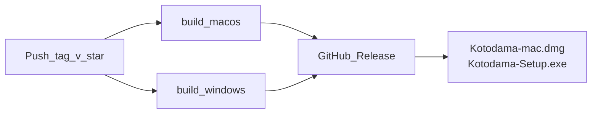

# リリース CI / GitHub Releases 引き継ぎ（2026-06-22）

次セッション向け。**配布ビルド検証の続き + GHA ビルド + GitHub Releases 配布** を一本化するための記録。

- 全体の落とし穴・設計: [handover.md](./handover.md)
- 実機検証手順・チェックリスト: [dist-verification-plan.md](./dist-verification-plan.md)
- ビルド設定: [electron-builder.yml](../electron-builder.yml)、[package.json](../package.json)

---

## 1. ここまで完了したこと

### 配布ビルド（最小構成）

| 項目 | 状態 |
| --- | --- |
| 検証プラン作成 | [dist-verification-plan.md](./dist-verification-plan.md) |
| macOS `npm run dist:mac`（未署名） | ビルド OK |
| Windows `npm run dist:win`（Mac ホストから） | ビルド OK（**win-arm64** のみ） |
| **macOS 実機 E2E**（必須 #1〜5） | **PASS**（2026-06-22、ユーザー確認） |
| Windows 実機 E2E | **未実施** |

### macOS UX 改善（配布ビルド向け）

| 項目 | 内容 |
| --- | --- |
| 表示名 | `Kotodama`（`productName` / `CFBundleDisplayName` / UI） |
| 権限オンボーディング | [permissions.ts](../src/main/permissions.ts) — 入力監視案内、deep link、`.app` パスコピー |
| 設定画面 | macOS 権限セクション（マイク / アクセシビリティ / 入力監視） |
| 関連 | [global-keys.ts](../src/main/global-keys.ts)、[SettingsView.tsx](../src/renderer/src/views/SettingsView.tsx) |

### ローカルビルド成果物（参考）

| OS | パス | 備考 |
| --- | --- | --- |
| macOS arm64 | `dist/Kotodama-0.1.0-arm64.dmg` | 実機検証済 |
| Windows | `dist/Kotodama Setup 0.1.0.exe` | Mac 上ビルド → **arm64**。一般 PC（x64）向けではない |

### CI / Releases

- **`.github/workflows/` は未作成**
- GitHub Releases への自動アップロードは未実装

---

## 2. 次のゴール（PO 意向）

1. **Windows x64** を `windows-latest`（GHA）でビルド
2. 成果物を **GitHub Releases** から配布（手動転送より Releases を正とする）
3. ダウンロードしたインストーラで **Windows 実機 E2E**（[dist-verification-plan.md](./dist-verification-plan.md) フェーズ 2）
4. mac / win 両方 PASS 後、[handover.md:178](./handover.md) を `[x]` に更新

**後回し**: 署名・公証・SmartScreen 用コード署名、正式アイコン、App Store / MS Store

---

## 3. 推奨構成: GHA + GitHub Releases

### トリガー（最小）

| トリガー | 用途 |
| --- | --- |
| `push: tags: ['v*']` | 本番リリース（例: `v0.1.0`）→ ビルド + Release 作成 |
| `workflow_dispatch` | 手動プレリリース / Windows 検証用ビルド |

タグ push 時は `package.json` の `version` とタグを一致させる（例: tag `v0.1.0` ↔ version `0.1.0`）。

### ジョブ構成



| ジョブ | runner | コマンド | 成果物（electron-builder 既定） |
| --- | --- | --- | --- |
| `build-macos` | `macos-latest` | `npm run dist:mac` | `dist/Kotodama-<ver>-arm64.dmg`（+ zip） |
| `build-windows` | `windows-latest` | `npm run dist:win` | `dist/Kotodama Setup <ver>.exe`（**x64**） |

両ジョブ共通の環境変数:

```yaml
env:
  CSC_IDENTITY_AUTO_DISCOVERY: false
  # macOS のみ
  CSC_IDENTITY: "-"
```

両ジョブ共通ステップ（要点）:

```yaml
- uses: actions/setup-node@v4
  with:
    node-version: 20
    cache: npm
- run: npm ci
- run: npm run rebuild
- run: npx electron-rebuild -f -w uiohook-napi
- run: npm run dist:mac  # or dist:win
```

### Release へのアップロード

**推奨**: [softprops/action-gh-release](https://github.com softprops/action-gh-release)（タグ push 時）

```yaml
- uses: softprops/action-gh-release@v2
  with:
    files: |
      dist/Kotodama-*-arm64.dmg
      dist/Kotodama Setup *.exe
    generate_release_notes: true
  env:
    GITHUB_TOKEN: ${{ secrets.GITHUB_TOKEN }}
```

- `permissions: contents: write` を workflow に付与（Release 作成に必要）
- プレリリース: `workflow_dispatch` + `prerelease: true` 入力

### 配布物の命名（Release Assets 例）

| Asset | 想定ファイル |
| --- | --- |
| macOS (Apple Silicon) | `Kotodama-0.1.0-arm64.dmg` |
| Windows (x64) | `Kotodama Setup 0.1.0.exe` |

Release 本文には [dist-verification-plan.md](./dist-verification-plan.md) の「未署名・SmartScreen 警告」を 1 行記載。

---

## 4. Windows 実機検証フロー（GHA 利用時）

1. タグ `v0.1.0` を push（または `workflow_dispatch`）→ GHA 完了
2. GitHub **Releases** から `Kotodama Setup 0.1.0.exe`（x64）をダウンロード
3. 実機でインストール → [dist-verification-plan.md](./dist-verification-plan.md) のチェックリスト #1〜5
4. 結果を同ドキュメントの Windows 列に記入
5. 両 OS PASS → handover 178 行目を `[x]` に

---

## 5. 実装タスク（次セッション用チェックリスト）

- [ ] `.github/workflows/release.yml` 作成（上記 §3）
- [ ] 初回 `workflow_dispatch` で Windows x64 成果物を Release / Artifacts に出す
- [ ] Windows 実機 E2E 実施・記録
- [ ] （任意）`README.md` に Releases からのインストール手順 1 段落
- [ ] 両 OS PASS 後 handover 更新

**触らないファイル（今回）**: 署名用 secrets、`build/icon.*`（プレースホルダのまま）

---

## 6. 既知の制約・注意

| 項目 | 内容 |
| --- | --- |
| Mac からの win クロスビルド | arch がホスト依存（Apple Silicon → win-arm64）。**x64 Windows 向けは windows-latest 必須** |
| ネイティブモジュール | 各 OS ジョブで `npm run rebuild` + `uiohook-napi` rebuild 必須 |
| 未署名 | Gatekeeper / SmartScreen 警告は想定内。一般配布前に署名は別タスク |
| macOS 権限 UI | Windows には macOS 権限セクションは出ない（設計どおり） |
| `appId` | 現状 `com.example.kotodama` — 本番配布前に要変更検討 |

---

## 7. 関連ファイル一覧（変更済み・参照用）

| ファイル | 役割 |
| --- | --- |
| [electron-builder.yml](../electron-builder.yml) | `productName: Kotodama`、mac entitlements |
| [src/main/permissions.ts](../src/main/permissions.ts) | macOS 権限案内・状態 |
| [src/main/global-keys.ts](../src/main/global-keys.ts) | uiohook 状態 export |
| [src/shared/ipc.ts](../src/shared/ipc.ts) | `MacPermissionStatus`、`inputMonitoringGuideDismissed` |
| [src/renderer/src/views/SettingsView.tsx](../src/renderer/src/views/SettingsView.tsx) | macOS 権限 UI |
